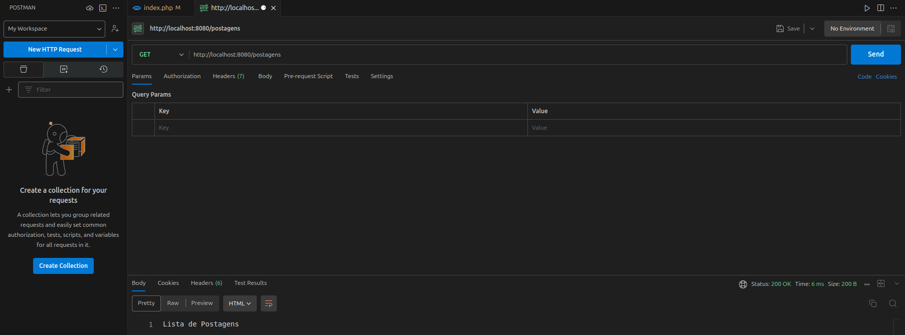
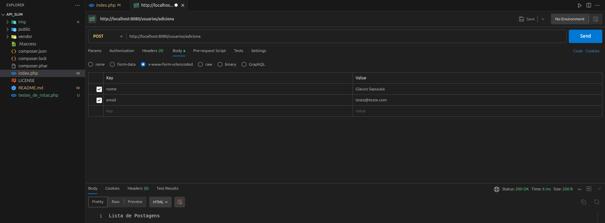
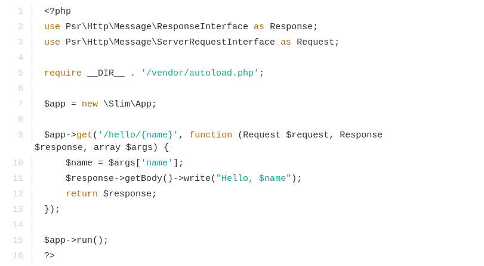

# API-Slim
My API

## Tools
- [compose](https://getcomposer.org/)
- [slim fw](https://www.slimframework.com/)
- [xampp](https://www.apachefriends.org/pt_br/index.html)
- [padrões PHP | PSRs](https://www.php-fig.org/)
- [postman](https://www.postman.com/)

## PSR 7

## Postman
### GET

### POST

## Slim error v3 | Page not found
Use o código de teste abaixo!  
